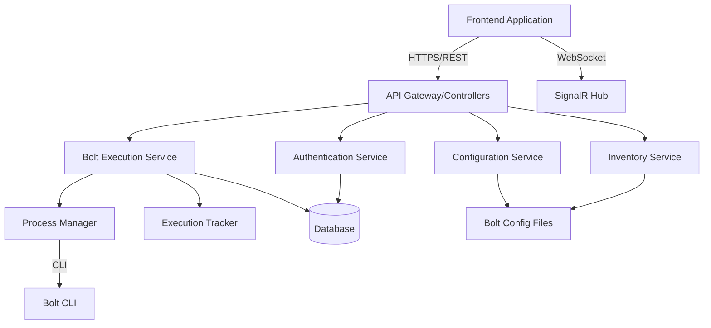

# Design Document

## Overview

The Puppet Bolt Web Interface backend is a RESTful API built with ASP.NET Core that provides a web-based interface for executing and managing Puppet Bolt commands. The backend acts as a secure intermediary between the frontend application and the Bolt CLI, handling command execution, authentication, logging, and real-time status updates.

### Technology Stack

- **Framework**: ASP.NET Core 8.0 (LTS)
- **Language**: C# 12
- **Authentication**: JWT (JSON Web Tokens)
- **Database**: SQLite for development, PostgreSQL/SQL Server for production
- **ORM**: Entity Framework Core
- **Process Management**: System.Diagnostics.Process
- **Real-time Communication**: SignalR for streaming output
- **API Documentation**: Swagger/OpenAPI

## Architecture

### High-Level Architecture



### Layered Architecture

1. **Presentation Layer**: API Controllers, SignalR Hubs
2. **Business Logic Layer**: Services (BoltExecutionService, InventoryService, etc.)
3. **Data Access Layer**: Repositories, Entity Framework DbContext
4. **Infrastructure Layer**: Process management, file system access, external CLI interaction

## Components and Interfaces

### 1. API Controllers

#### BoltCommandController
Handles execution of arbitrary Bolt commands.

```csharp
[ApiController]
[Route("api/bolt/commands")]
[Authorize]
public class BoltCommandController : ControllerBase
{
    // POST /api/bolt/commands/execute
    Task<ActionResult<CommandExecutionResult>> ExecuteCommand(CommandExecutionRequest request);
    
    // GET /api/bolt/commands/{executionId}/status
    Task<ActionResult<ExecutionStatus>> GetExecutionStatus(Guid executionId);
    
    // POST /api/bolt/commands/{executionId}/cancel
    Task<ActionResult> CancelExecution(Guid executionId);
}
```

#### BoltTaskController
Manages Bolt task operations.

```csharp
[ApiController]
[Route("api/bolt/tasks")]
[Authorize]
public class BoltTaskController : ControllerBase
{
    // GET /api/bolt/tasks
    Task<ActionResult<IEnumerable<BoltTask>>> ListTasks();
    
    // GET /api/bolt/tasks/{taskName}
    Task<ActionResult<BoltTaskDetails>> GetTaskDetails(string taskName);
    
    // POST /api/bolt/tasks/execute
    Task<ActionResult<TaskExecutionResult>> ExecuteTask(TaskExecutionRequest request);
}
```

#### BoltPlanController
Manages Bolt plan operations.

```csharp
[ApiController]
[Route("api/bolt/plans")]
[Authorize]
public class BoltPlanController : ControllerBase
{
    // GET /api/bolt/plans
    Task<ActionResult<IEnumerable<BoltPlan>>> ListPlans();
    
    // GET /api/bolt/plans/{planName}
    Task<ActionResult<BoltPlanDetails>> GetPlanDetails(string planName);
    
    // POST /api/bolt/plans/execute
    Task<ActionResult<PlanExecutionResult>> ExecutePlan(PlanExecutionRequest request);
}
```

#### InventoryController
Manages Bolt inventory.

```csharp
[ApiController]
[Route("api/bolt/inventory")]
[Authorize]
public class InventoryController : ControllerBase
{
    // GET /api/bolt/inventory
    Task<ActionResult<BoltInventory>> GetInventory();
    
    // GET /api/bolt/inventory/groups
    Task<ActionResult<IEnumerable<string>>> GetGroups();
    
    // GET /api/bolt/inventory/groups/{groupName}/nodes
    Task<ActionResult<IEnumerable<Node>>> GetNodesByGroup(string groupName);
}
```

#### ConfigurationController
Manages Bolt configuration.

```csharp
[ApiController]
[Route("api/bolt/config")]
[Authorize(Roles = "Admin")]
public class ConfigurationController : ControllerBase
{
    // GET /api/bolt/config
    Task<ActionResult<BoltConfiguration>> GetConfiguration();
    
    // PUT /api/bolt/config
    Task<ActionResult> UpdateConfiguration(BoltConfiguration config);
    
    // POST /api/bolt/config/validate
    Task<ActionResult<ValidationResult>> ValidateConfiguration(BoltConfiguration config);
}
```

#### HistoryController
Manages command execution history.

```csharp
[ApiController]
[Route("api/bolt/history")]
[Authorize]
public class HistoryController : ControllerBase
{
    // GET /api/bolt/history
    Task<ActionResult<PagedResult<ExecutionHistoryItem>>> GetHistory(
        int page = 1, 
        int pageSize = 20, 
        DateTime? startDate = null, 
        DateTime? endDate = null);
    
    // GET /api/bolt/history/{executionId}
    Task<ActionResult<ExecutionHistoryDetails>> GetExecutionDetails(Guid executionId);
}
```

#### AuthController
Handles authentication.

```csharp
[ApiController]
[Route("api/auth")]
public class AuthController : ControllerBase
{
    // POST /api/auth/login
    Task<ActionResult<AuthenticationResponse>> Login(LoginRequest request);
    
    // POST /api/auth/refresh
    Task<ActionResult<AuthenticationResponse>> RefreshToken(RefreshTokenRequest request);
    
    // POST /api/auth/logout
    Task<ActionResult> Logout();
}
```

### 2. SignalR Hub

#### ExecutionHub
Provides real-time updates for command execution.

```csharp
[Authorize]
public class ExecutionHub : Hub
{
    // Client subscribes to execution updates
    Task SubscribeToExecution(Guid executionId);
    
    // Client unsubscribes from execution updates
    Task UnsubscribeFromExecution(Guid executionId);
}

// Server-to-client methods
// - OnOutputReceived(Guid executionId, string output, string stream)
// - OnExecutionCompleted(Guid executionId, ExecutionResult result)
// - OnExecutionFailed(Guid executionId, string error)
```

### 3. Core Services

#### IBoltExecutionService
Core service for executing Bolt commands.

```csharp
public interface IBoltExecutionService
{
    Task<CommandExecutionResult> ExecuteCommandAsync(
        string command, 
        string[] arguments, 
        string userId, 
        CancellationToken cancellationToken = default);
    
    Task<TaskExecutionResult> ExecuteTaskAsync(
        string taskName, 
        string[] targets, 
        Dictionary<string, object> parameters, 
        string userId,
        CancellationToken cancellationToken = default);
    
    Task<PlanExecutionResult> ExecutePlanAsync(
        string planName, 
        Dictionary<string, object> parameters, 
        string userId,
        CancellationToken cancellationToken = default);
    
    Task<ExecutionStatus> GetExecutionStatusAsync(Guid executionId);
    
    Task CancelExecutionAsync(Guid executionId);
}
```

#### IProcessManager
Manages Bolt CLI process execution.

```csharp
public interface IProcessManager
{
    Task<ProcessExecutionResult> ExecuteAsync(
        string executable,
        string[] arguments,
        Action<string> onStdOut = null,
        Action<string> onStdErr = null,
        CancellationToken cancellationToken = default);
    
    Task<bool> IsProcessRunningAsync(Guid executionId);
    
    Task KillProcessAsync(Guid executionId);
}
```

#### IInventoryService
Manages Bolt inventory operations.

```csharp
public interface IInventoryService
{
    Task<BoltInventory> GetInventoryAsync();
    
    Task<IEnumerable<string>> GetGroupsAsync();
    
    Task<IEnumerable<Node>> GetNodesByGroupAsync(string groupName);
    
    Task<bool> ValidateInventoryAsync();
}
```

#### IConfigurationService
Manages Bolt configuration.

```csharp
public interface IConfigurationService
{
    Task<BoltConfiguration> GetConfigurationAsync();
    
    Task UpdateConfigurationAsync(BoltConfiguration config, string userId);
    
    Task<ValidationResult> ValidateConfigurationAsync(BoltConfiguration config);
}
```

#### IExecutionHistoryService
Manages execution history and logging.

```csharp
public interface IExecutionHistoryService
{
    Task LogExecutionAsync(ExecutionHistoryItem item);
    
    Task<PagedResult<ExecutionHistoryItem>> GetHistoryAsync(
        int page, 
        int pageSize, 
        DateTime? startDate = null, 
        DateTime? endDate = null,
        string userId = null);
    
    Task<ExecutionHistoryDetails> GetExecutionDetailsAsync(Guid executionId);
}
```

#### IAuthenticationService
Handles user authentication and authorization.

```csharp
public interface IAuthenticationService
{
    Task<AuthenticationResponse> AuthenticateAsync(string username, string password);
    
    Task<AuthenticationResponse> RefreshTokenAsync(string refreshToken);
    
    Task<bool> ValidateTokenAsync(string token);
    
    Task RevokeTokenAsync(string token);
}
```

## Data Models

### Domain Models

```csharp
public class CommandExecutionRequest
{
    public string Command { get; set; }
    public string[] Arguments { get; set; }
    public int? TimeoutSeconds { get; set; }
}

public class CommandExecutionResult
{
    public Guid ExecutionId { get; set; }
    public int ExitCode { get; set; }
    public string StandardOutput { get; set; }
    public string StandardError { get; set; }
    public TimeSpan ExecutionTime { get; set; }
    public DateTime StartedAt { get; set; }
    public DateTime CompletedAt { get; set; }
    public bool Success { get; set; }
}

public class TaskExecutionRequest
{
    public string TaskName { get; set; }
    public string[] Targets { get; set; }
    public Dictionary<string, object> Parameters { get; set; }
    public int? TimeoutSeconds { get; set; }
}

public class TaskExecutionResult
{
    public Guid ExecutionId { get; set; }
    public string TaskName { get; set; }
    public List<NodeResult> NodeResults { get; set; }
    public TimeSpan ExecutionTime { get; set; }
    public bool Success { get; set; }
}

public class NodeResult
{
    public string NodeName { get; set; }
    public bool Success { get; set; }
    public object Result { get; set; }
    public string Error { get; set; }
}

public class PlanExecutionRequest
{
    public string PlanName { get; set; }
    public Dictionary<string, object> Parameters { get; set; }
    public int? TimeoutSeconds { get; set; }
}

public class PlanExecutionResult
{
    public Guid ExecutionId { get; set; }
    public string PlanName { get; set; }
    public object ReturnValue { get; set; }
    public string Output { get; set; }
    public TimeSpan ExecutionTime { get; set; }
    public bool Success { get; set; }
}

public class BoltInventory
{
    public int Version { get; set; }
    public List<InventoryGroup> Groups { get; set; }
    public List<Node> Nodes { get; set; }
}

public class InventoryGroup
{
    public string Name { get; set; }
    public List<Node> Nodes { get; set; }
    public Dictionary<string, object> Config { get; set; }
}

public class Node
{
    public string Name { get; set; }
    public string Uri { get; set; }
    public Dictionary<string, object> Config { get; set; }
    public List<string> Groups { get; set; }
}

public class BoltConfiguration
{
    public string ModulePath { get; set; }
    public string InventoryFile { get; set; }
    public int Concurrency { get; set; }
    public Dictionary<string, object> Transport { get; set; }
    public Dictionary<string, object> AdditionalSettings { get; set; }
}

public class ExecutionStatus
{
    public Guid ExecutionId { get; set; }
    public ExecutionState State { get; set; }
    public string CurrentOutput { get; set; }
    public DateTime StartedAt { get; set; }
    public TimeSpan ElapsedTime { get; set; }
}

public enum ExecutionState
{
    Queued,
    Running,
    Completed,
    Failed,
    Cancelled
}

public class BoltTask
{
    public string Name { get; set; }
    public string Description { get; set; }
    public string Module { get; set; }
}

public class BoltTaskDetails : BoltTask
{
    public Dictionary<string, TaskParameter> Parameters { get; set; }
}

public class TaskParameter
{
    public string Type { get; set; }
    public string Description { get; set; }
    public bool Required { get; set; }
    public object Default { get; set; }
}

public class BoltPlan
{
    public string Name { get; set; }
    public string Description { get; set; }
    public string Module { get; set; }
}

public class BoltPlanDetails : BoltPlan
{
    public Dictionary<string, PlanParameter> Parameters { get; set; }
}

public class PlanParameter
{
    public string Type { get; set; }
    public string Description { get; set; }
    public bool Required { get; set; }
    public object Default { get; set; }
}
```

### Database Entities

```csharp
public class ExecutionHistoryEntity
{
    public Guid Id { get; set; }
    public string UserId { get; set; }
    public string Username { get; set; }
    public ExecutionType Type { get; set; } // Command, Task, Plan
    public string Command { get; set; }
    public string Arguments { get; set; }
    public DateTime StartedAt { get; set; }
    public DateTime? CompletedAt { get; set; }
    public TimeSpan? ExecutionTime { get; set; }
    public int? ExitCode { get; set; }
    public string StandardOutput { get; set; }
    public string StandardError { get; set; }
    public bool Success { get; set; }
    public ExecutionState State { get; set; }
}

public class UserEntity
{
    public string Id { get; set; }
    public string Username { get; set; }
    public string PasswordHash { get; set; }
    public string Email { get; set; }
    public string Role { get; set; }
    public DateTime CreatedAt { get; set; }
    public DateTime? LastLoginAt { get; set; }
    public bool IsActive { get; set; }
}

public class RefreshTokenEntity
{
    public string Token { get; set; }
    public string UserId { get; set; }
    public DateTime ExpiresAt { get; set; }
    public DateTime CreatedAt { get; set; }
    public bool IsRevoked { get; set; }
}

public class ConfigurationChangeEntity
{
    public Guid Id { get; set; }
    public string UserId { get; set; }
    public string Username { get; set; }
    public DateTime ChangedAt { get; set; }
    public string PreviousConfiguration { get; set; }
    public string NewConfiguration { get; set; }
}
```

## Error Handling

### Error Response Model

```csharp
public class ErrorResponse
{
    public string Message { get; set; }
    public string ErrorCode { get; set; }
    public Dictionary<string, string[]> ValidationErrors { get; set; }
    public string TraceId { get; set; }
}
```

### Error Handling Strategy

1. **Global Exception Handler**: Middleware to catch unhandled exceptions
2. **Validation Errors**: Return 400 Bad Request with detailed validation messages
3. **Authentication Errors**: Return 401 Unauthorized
4. **Authorization Errors**: Return 403 Forbidden
5. **Not Found Errors**: Return 404 Not Found
6. **Bolt CLI Errors**: Parse stderr and return appropriate error messages
7. **Process Timeout**: Return 408 Request Timeout
8. **Internal Errors**: Return 500 Internal Server Error with sanitized messages

### Logging

- Use structured logging with Serilog
- Log levels: Debug, Information, Warning, Error, Critical
- Log all API requests and responses
- Log all Bolt command executions
- Log authentication attempts
- Store logs in files and optionally send to centralized logging service

## Testing Strategy

### Unit Tests

- Test all service methods in isolation using mocks
- Test validation logic
- Test data transformations
- Test authentication and authorization logic
- Use xUnit as the testing framework
- Use Moq for mocking dependencies
- Aim for 80%+ code coverage

### Integration Tests

- Test API endpoints with in-memory database
- Test Bolt CLI integration with mock processes
- Test SignalR hub connections
- Use WebApplicationFactory for integration testing
- Test authentication flow end-to-end

### End-to-End Tests

- Test complete workflows (login → execute command → view history)
- Test real Bolt CLI execution in controlled environment
- Test concurrent executions
- Test timeout and cancellation scenarios

### Performance Tests

- Load test API endpoints
- Test concurrent Bolt executions
- Measure response times under load
- Test database query performance

## Security Considerations

### Authentication & Authorization

- JWT tokens with short expiration (15 minutes)
- Refresh tokens with longer expiration (7 days)
- Role-based access control (Admin, User)
- Secure password hashing using BCrypt or Argon2

### Input Validation

- Validate all user inputs
- Sanitize command arguments to prevent injection attacks
- Whitelist allowed Bolt commands if needed
- Validate file paths to prevent directory traversal

### Process Security

- Run Bolt CLI with limited privileges
- Set working directory restrictions
- Enforce command timeouts
- Limit concurrent executions per user

### API Security

- HTTPS only in production
- CORS configuration for frontend origin
- Rate limiting to prevent abuse
- Request size limits
- API key or token validation on all protected endpoints

### Data Protection

- Encrypt sensitive configuration data at rest
- Don't log sensitive information (passwords, keys)
- Sanitize output before returning to client
- Implement audit logging for sensitive operations

## Configuration

### Application Settings (appsettings.json)

```json
{
  "Bolt": {
    "ExecutablePath": "/usr/local/bin/bolt",
    "WorkingDirectory": "/etc/puppetlabs/bolt",
    "DefaultTimeout": 300,
    "MaxConcurrentExecutions": 5,
    "InventoryFile": "inventory.yaml",
    "ConfigFile": "bolt-project.yaml"
  },
  "Authentication": {
    "JwtSecret": "your-secret-key",
    "JwtExpirationMinutes": 15,
    "RefreshTokenExpirationDays": 7,
    "Issuer": "BoltWebAPI",
    "Audience": "BoltWebClient"
  },
  "Database": {
    "Provider": "SQLite",
    "ConnectionString": "Data Source=bolt.db"
  },
  "Logging": {
    "LogLevel": {
      "Default": "Information",
      "Microsoft.AspNetCore": "Warning"
    },
    "FilePath": "logs/bolt-api-.log"
  },
  "RateLimiting": {
    "PermitLimit": 100,
    "Window": "00:01:00"
  }
}
```

## Deployment Considerations

### Prerequisites

- .NET 8.0 Runtime
- Puppet Bolt CLI installed and accessible
- Database (SQLite for dev, PostgreSQL/SQL Server for prod)
- Reverse proxy (nginx/IIS) for HTTPS termination

### Environment Variables

- `ASPNETCORE_ENVIRONMENT`: Development/Staging/Production
- `JWT_SECRET`: Secret key for JWT signing
- `DATABASE_CONNECTION_STRING`: Database connection string
- `BOLT_EXECUTABLE_PATH`: Path to Bolt CLI

### Docker Support

- Create Dockerfile for containerized deployment
- Include Bolt CLI in container image
- Use multi-stage build for smaller image size
- Mount configuration files as volumes

### Monitoring

- Health check endpoint: `/health`
- Metrics endpoint: `/metrics` (Prometheus format)
- Application Insights or similar APM tool
- Monitor Bolt CLI execution times and failures
